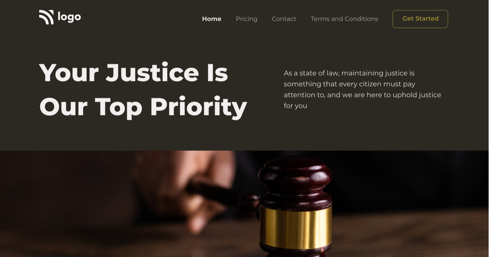

# Assignment 1

## Project 3 [Live Link](https://samdish-project-3.netlify.app)

-   Skills Gained in this project
    -   Learnd to Place an image inside div and centering image without squishing or breaking image size with **object-fit** & **object-position**

---

## Time taken to finish this project

-   Approximately 2 hour taken to complete this project.

#### Preview

